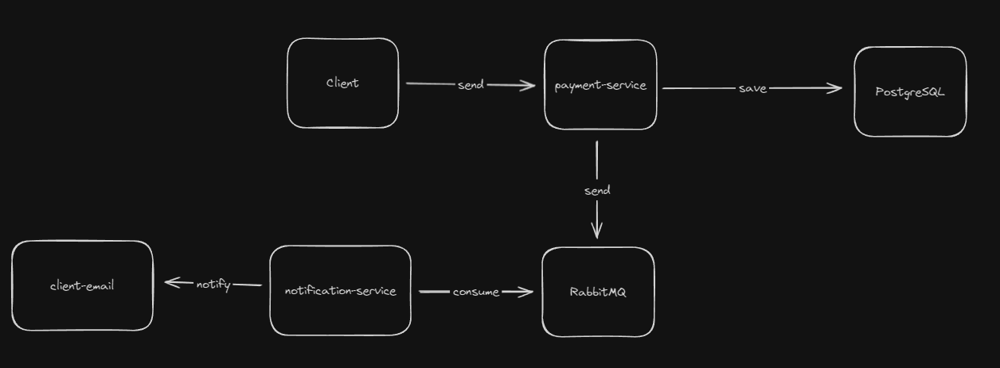

# Buy Easily

## Arquitetura do Projeto

**Visão Geral**

O projeto é composto por dois serviços principais: `payment` e `notification`. Cada serviço possui seu próprio container Docker e utiliza o banco de dados PostgreSQL para armazenar dados. A comunicação entre os serviços é feita através de fila de mensagens RabbitMQ.

**Fluxo de Processo**

1. O cliente envia uma solicitação de pagamento para o serviço `payment`.
2. O serviço `payment` processa a solicitação e salva as informações no banco de dados PostgreSQL.
3. O serviço `payment` envia uma mensagem para a fila de mensagens RabbitMQ informando que o pagamento foi realizado.
4. O serviço `notification` consome a mensagem da fila de mensagens RabbitMQ e envia um email de notificação para o usuário informando que o pagamento foi realizado.

**Diagrama de Blocos**

**Tecnologias Utilizadas**

* **Linguagem de Programação:** Node.js
* **Framework:** Express.js
* **Banco de Dados:** PostgreSQL
* **Fila de Mensagens:** RabbitMQ
* **Orquestração de Containers:** Docker Compose
* **Ferramenta de Migração de Banco de Dados:** Prisma

**Benefícios da Arquitetura**

* **Modularidade:** A arquitetura modular facilita o desenvolvimento, a manutenção e a testagem do projeto.
* **Escalabilidade:** Os serviços podem ser facilmente escalados horizontalmente para atender a um aumento na demanda.
* **Alta Disponibilidade:** A fila de mensagens RabbitMQ garante que as mensagens sejam entregues mesmo que um dos serviços esteja indisponível.
* **Resiliência a Falhas:** Os containers Docker garantem que os serviços sejam reiniciados automaticamente em caso de falhas.

**Considerações Adicionais**

* **Segurança:** É importante tomar medidas de segurança para proteger o projeto contra ataques.
* **Monitoramento:** É recomendável monitorar o desempenho e a saúde do projeto para identificar e resolver problemas rapidamente.

## Execução do projeto em ambiente de desenvolvimento

**Configuração de Variáveis de Ambiente (Importante!)**

Antes de iniciar, é crucial configurar algumas variáveis de ambiente no arquivo `.env` dentro da pasta `notification`. **Lembre-se de substituir os valores de exemplo por suas credenciais reais!**

**Segurança em Primeiro Lugar:**

* **USER_EMAIL:** Insira o email do usuário com ID 10.
* **EMAIL:** Defina o email padrão a ser utilizado.
* **EMAIL_PASSWORD:** Informe a senha do email padrão.

**Observação Essencial:**

Para garantir o bom funcionamento do envio de emails, ative a opção "Apps menos seguros" em sua conta de email. Caso contrário, erros poderão ocorrer.

**Informações Úteis**

* **Coleção Postman:** Para facilitar seus testes, uma collection do Postman está disponível na raiz do projeto.

**Executando Localmente**

1. **Navegue até a pasta do projeto:** Acesse o diretório principal do projeto no seu terminal.
2. **Inicie o projeto:** Execute o comando `docker-compose up -d`.
3. **Migração de Banco de Dados (pasta /payment):**
    * Acesse a pasta `/payment`.
    * Execute o comando `npx prisma migrate dev`.
    * Inicie o serviço com o comando `npm run start`.
4. **Migração de Banco de Dados (pasta /notification):**
    * Abra outro terminal.
    * Acesse a pasta `/notification`.
    * Execute o comando `npx prisma migrate dev`.
    * Inicie o serviço com o comando `npm run start`.

**Pronto!** O projeto estará em execução localmente e você poderá realizar seus testes.
